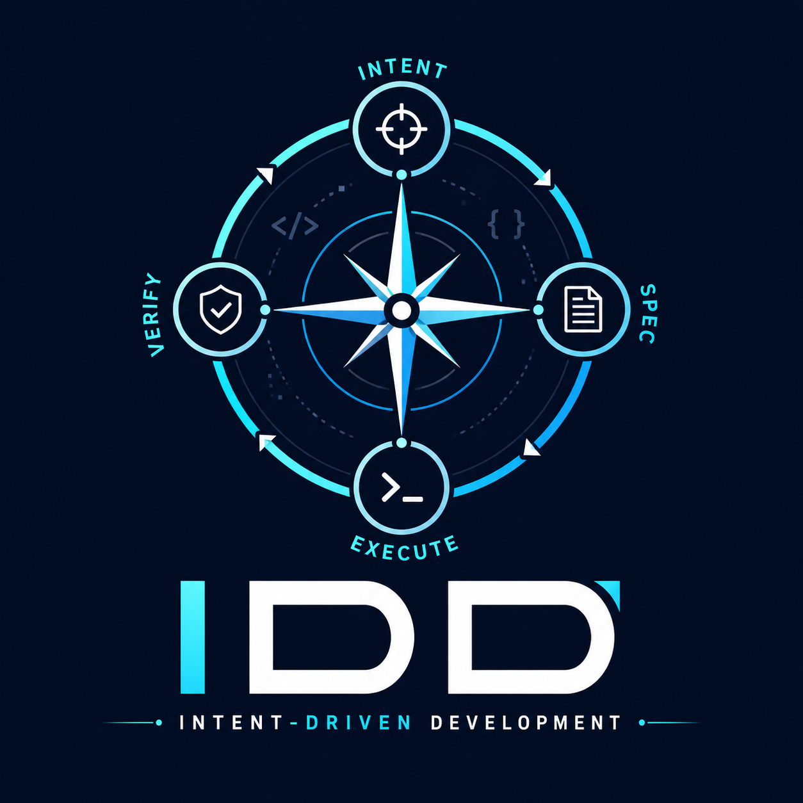

# IDD — Intent-Driven Development



> **Intent is the source. Spec is the contract. Verification reconciles reality.**

A Claude Code plugin that encodes a lightweight-but-thorough Spec-Driven Development lifecycle for working with AI coding agents on real repositories.

IDD is parallel framing to TDD / BDD / DDD / SDD — a methodology, not a tool. It optimizes for **disciplined, resumable** software work over speed-first coding. The workflow may produce several artifacts, but each one earns its place by clarifying intent, preserving context, reducing drift, or verifying reality.

---

## Why IDD?

You already have an AI coding agent. IDD adds the missing scaffolding around it:

- **Intent** is treated as the project north-star — the *why* behind any change.
- **Spec** is the contract for intended behavior — adversarially refined before code is written.
- **Verification** reconciles spec, code, tests, runtime behavior, and user confirmation — three layers, not just "tests pass."
- **Crucible** is an adversarial post-plan ritual (assumptions inversion → adversarial Q&A → pre-mortem) that produces a shared `UNDERSTANDING.md` between you and the agent.
- **Context discipline** keeps your main thread under a hard token budget (~25K for a standard-tier feature) by isolating slices in subagents and preventing context bleed.
- **Cross-AI review** uses a different model family (Claude ↔ GPT) as a second-opinion reviewer, reinforcing the adversarial shared-understanding goal.

IDD pays off when the cost of building the wrong thing, losing context, drifting from intent, or losing your own mental model of the code is higher than the cost of a disciplined workflow. It is **not** the fastest path to code. It *is* a clear path from intent to verified behavior — without surrendering your understanding of the system along the way.

---

## Lifecycle

```
refine → research → spec → domain → scenarios → plan → crucible → review → execute → verify → ship
```

| Phase | Output | Purpose |
|---|---|---|
| **refine** | refined idea statement | Sharpen a vague idea into a single-feature scope |
| **research** | `RESEARCH.md` (optional) | Gather facts before the spec is locked |
| **spec** | `SPEC.md` | Behavior contract: Intent, Domain, Scope, Scenarios, Acceptance, Open Questions |
| **domain** | glossary + optional Mermaid sketch | Ubiquitous language; escalates to bounded contexts when needed |
| **scenarios** | Gherkin scenarios in `SPEC.md` | BDD acceptance criteria; auto-escalates to `.feature` files when project supports it |
| **plan** | `PLAN.md` | Vertical slices and waves of parallelizable tasks; file-bound |
| **crucible** | `UNDERSTANDING.md` | Adversarial ritual: assumptions inversion → adversarial Q&A → pre-mortem |
| **review** | `REVIEW.plan.md` / `REVIEW.code.md` | Layered self + heavy + cross-AI reviews with convergence loops (per-target file) |
| **execute** | code + tests | Slice-isolated, subagent-bounded, wave-parallel implementation |
| **verify** | `VERIFICATION.md` | Three layers: code audit + scenario execution + conversational UAT |
| **ship** | merged change + updated canonical spec or delta proposal | Reconcile feature spec with shipped capability spec |

Phases can be skipped via flags or selected automatically by `/idd-do`, which estimates the right tier and routes accordingly.

---

## Tiers

`--focused` means **narrow**, not necessarily fast. Pick the tier that matches the change's risk and surface area, not your patience.

| Tier | Phases | Use when |
|---|---|---|
| `--focused` | `spec → execute → verify` | One-file fixes, surgical changes, well-understood bugs |
| `--standard` | `spec → scenarios → plan → crucible → execute → verify → ship` | Most features; cross-file changes; non-trivial behavior |
| `--full` | entire pipeline | New subsystems, cross-cutting refactors, anything requiring deep research and DDD |

### Focused tier (M1)

```
/idd:spec --focused → /idd:execute → /idd:verify
```

The shortest path through IDD. Pick this for one-file fixes and surgical changes where scenarios, planning, and crucible would be overhead.

### Standard tier (M2)

```
/idd:spec --standard
  → /idd:scenarios
  → /idd:plan
  → /idd:crucible
  → /idd:review                  # target plan (default after crucible)
  → /idd:execute
  → /idd:review --target code    # target code diff against PLAN.md
  → /idd:verify
  → /idd:ship
```

Each command refuses to run unless the previous phase is complete (state machine guard). The `idd-context-budget` and `idd-subagent-dispatch` skills enforce the per-subagent token budget at every dispatch.

**M2 limitations (called out so you don't trip on them):**

- **`/idd:ship` is first-ship only.** If `.idd/specs/<capability>/SPEC.md` already exists for the capability slug, ship aborts with a "delta proposal required" message. Delta proposals (`/idd:change`) land in M3+.
- **`/idd:review --cross-ai` is not implemented.** Cross-AI review (Claude ↔ GPT second-opinion pass) is M4 territory; the flag errors out today.
- **Refine, research, and domain phases are M3+.** The `--full` pipeline isn't ready yet — pick `--standard` for now even on broader features.

---

## Per-feature artifacts

Every IDD feature lives in `.idd/features/<id>/` with a small set of contracts:

- `SPEC.md` — the behavior contract
- `RESEARCH.md` — optional, for research tier and above
- `UNDERSTANDING.md` — output of the crucible
- `PLAN.md` — file-bound vertical slices and waves
- `REVIEW.plan.md` / `REVIEW.code.md` — per-target review findings and convergence cycles (the standard-tier flow runs review twice; each pass writes its own file)
- `VERIFICATION.md` — three-layer verification record
- `decisions.md` — running log of decisions and rationale
- `state.json` — phase/slice/wave state for `/idd-resume`

Canonical capability specs live in `.idd/specs/<capability>/SPEC.md`. Feature specs are working artifacts and are merged or archived against canonical specs at ship time. Changes to shipped specs flow through OpenSpec-style delta proposals in `.idd/changes/<id>/proposal.md`.

A project-wide `.idd/CONSTITUTION.md` carries CRITICAL / SHOULD / MAY articles enforced at every phase entry.

---

## The crucible

The crucible is IDD's most opinionated piece — an adversarial ritual run *after* planning and *before* execution:

1. **Assumptions inversion.** Every load-bearing assumption is inverted: "what if this is wrong?"
2. **Adversarial Q&A.** The agent argues against the plan, surfacing the strongest objections.
3. **Pre-mortem.** Imagine the change has shipped and failed — what failed and why?

The output is `UNDERSTANDING.md` — a record of shared understanding between you and the agent. Code that doesn't survive the crucible doesn't get written.

---

## Verification

Three layers, all rolled into `VERIFICATION.md`:

1. **Code audit.** Static review of the implementation against the spec.
2. **Scenario execution.** Acceptance scenarios run against the actual code (BDD when supported, manual checklist otherwise).
3. **Conversational UAT.** Structured back-and-forth with the user to confirm behavior matches intent.

A feature ships only after all three layers pass.

---

## Install (Claude Code)

_Full plugin install is coming after M1 ships._ Until then:

1. Clone this repo somewhere local.
2. Reference it via your Claude Code plugin path (see [Claude Code plugin docs](https://code.claude.com/docs/en/plugins-reference)).
3. The slash commands `/idd:spec`, `/idd:execute`, `/idd:verify` light up once the plugin is loaded.

A formal install path (`claude plugins install …`) ships with M1.

---

## Use outside Claude Code

`AGENTS.md` at the repo root is a portable discovery manifest. Cursor, Aider, and Codex consume the same plain-markdown skills and commands. Full portability validation lands in M5; the markdown source is already portable today.

---

## Configuration

Per-feature state lives in `.idd/features/<id>/state.json` (created by `/idd:spec`). Project-wide configuration (default tier, cross-AI provider, context-budget overrides, auto-escalation rules) is planned for a later milestone — not present in M1.

The tooling itself (state machine, frontmatter linter, schema validator) is a small Python package shipped in `tools/`.

---

## Project layout

```
idd/
├── .claude-plugin/plugin.json   Claude Code manifest
├── AGENTS.md                    portable discovery manifest
├── README.md                    you are here
├── commands/                    /idd:* slash commands
├── skills/                      ambient + invokable skills
├── hooks/                       PreToolUse hooks (real budget enforcement)
├── templates/feature/           per-feature artifact templates
├── schemas/                     JSON Schemas for state and frontmatter
├── tools/                       Python: state machine, linters, schema validator
└── tests/                       unit + smoke + reference fixtures
```

---

## Contributing

IDD is in early active development. Issues and feedback are welcome. Pull requests are accepted once the M1 reference fixture lands — the fixture defines the contract for what "passing" means.

---

## License

MIT — see [LICENSE](LICENSE).
