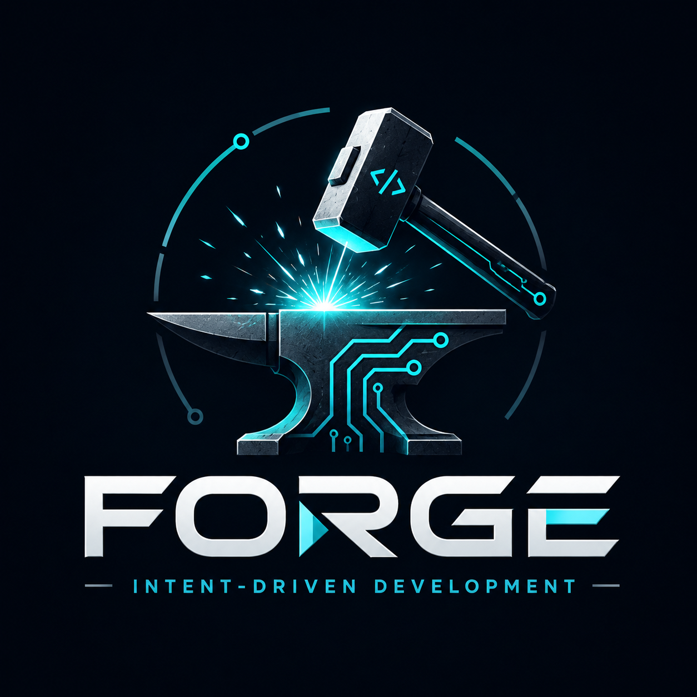

# FORGE — Intent-Driven Development



[](LICENSE)
[](https://www.python.org/downloads/)
[](https://github.com/astral-sh/ruff)
[](https://mypy-lang.org/)
[](https://docs.pytest.org/)

[](https://code.claude.com)

> **Intent is the source. Spec is the contract. Verification reconciles reality.**

FORGE is a Claude Code plugin that encodes a disciplined Spec-Driven Development lifecycle for working with AI coding agents on real repositories. It is parallel framing to TDD / BDD / DDD / SDD — a methodology, not a tool.

FORGE optimizes for **disciplined, resumable** software work over speed-first coding. Every artifact it produces earns its place by clarifying intent, preserving context, reducing drift, or verifying reality.

---

## What it is

A small set of slash commands, skills, hooks, and JSON-schema-validated artifacts that walk an AI coding agent through twelve phases — from a vague idea through verified, shipped, and QA'd change. State is persisted on disk per feature, so any session can be paused, resumed, or handed off without losing context.

## Why use it

You already have an AI coding agent. FORGE adds the missing scaffolding around it:

- **Intent** is treated as the project north-star — the *why* behind any change.
- **Spec** is the contract for intended behavior — adversarially refined before code is written.
- **Verification** reconciles spec, code, tests, runtime behavior, and user confirmation — three layers, not just "tests pass."
- **Crucible** is an adversarial post-plan ritual (assumptions inversion → adversarial Q&A → pre-mortem) that produces a shared `UNDERSTANDING.md` between you and the agent.
- **QA** is a fresh-outsider black-box pass after ship — an agent with no implementation context exercises the artifact from a user's perspective, attempts edge cases, and red-teams it. Verdict gates the pre-PR prompt; advisory post-merge.
- **TDD** is mechanical, not aspirational — every acceptance criterion requires a paired test commit before its impl commit, enforced by `tools.validate.tdd_evidence`.
- **Context discipline** keeps the main thread under a hard token budget by isolating slices in subagents and preventing context bleed.
- **Cross-AI review** uses a different model family (Claude ↔ GPT) as a second-opinion reviewer, reinforcing the adversarial shared-understanding goal.

FORGE pays off when the cost of building the wrong thing, losing context, drifting from intent, or losing your own mental model of the code is higher than the cost of a disciplined workflow. It is **not** the fastest path to code. It *is* a clear path from intent to verified behavior — without surrendering your understanding of the system along the way.

---

## How to use it

Install the plugin (see below), then drive a feature through the lifecycle with one command:

```text
/forge:do "<your idea>" [--focused | --standard | --full]
```

`/forge:do` runs preflights, scans for capability conflicts, picks a tier, and seeds the per-feature folder under `.forge/features/<id>/`. It then dispatches the next slash command in the chosen tier.

Prefer to drive each phase manually? Each phase has its own slash command (`/forge:refine`, `/forge:spec`, `/forge:domain`, `/forge:scenarios`, `/forge:plan`, `/forge:crucible`, `/forge:review`, `/forge:execute`, `/forge:verify`, `/forge:ship`, `/forge:qa`) — research is currently skipped (recorded in `state.json.skipped`); manual research before spec is acceptable. Each command refuses to run unless the previous phase is complete — the on-disk state machine is the source of truth.

---

## Lifecycle

```text
refine → research → spec → domain → scenarios → plan → crucible → review → execute → verify → ship → qa
```

| Phase | Output | Purpose |
| --- | --- | --- |
| **refine** | refined idea statement | Sharpen a vague idea into a single-feature scope |
| **research** | `RESEARCH.md` (optional) | Gather facts before the spec is locked |
| **spec** | `SPEC.md` | Behavior contract: Intent, Domain, Scope, Scenarios, Acceptance, Open Questions |
| **domain** | `DOMAIN.md` (full tier) — glossary, bounded contexts, aggregates, invariants | Ubiquitous language with auto-rendered bounded-context Mermaid; SPEC.md `# Domain` becomes a pointer |
| **scenarios** | Gherkin scenarios in `SPEC.md` | BDD acceptance criteria; auto-escalates to `.feature` files when the project supports it |
| **plan** | `PLAN.md` | Vertical slices and waves of parallelizable tasks; file-bound |
| **crucible** | `UNDERSTANDING.md` | Adversarial ritual: assumptions inversion → adversarial Q&A → pre-mortem |
| **review** | `REVIEW.plan.md` / `REVIEW.code.md` | Layered self + heavy + cross-AI reviews with convergence loops |
| **execute** | code + tests | Slice-isolated, subagent-bounded, wave-parallel implementation. TDD pairing enforced — every AC requires a `test(...)` commit before its `feat(...)` commit. |
| **verify** | `VERIFICATION.md` | Three layers: code audit + scenario execution + conversational UAT |
| **ship** | merged change + updated canonical spec or delta proposal | Reconcile feature spec with shipped capability spec. Pre-PR QA gate prompt available. |
| **qa** | `QA.md` with verdict + confidence | Fresh-outsider black-box pass: acceptance + edge probing + adversarial + NR regrep. Terminal phase; archives on completion. |

Phases can be skipped via flags or selected automatically by `/forge:do`, which estimates the right tier and routes accordingly.

---

## Tiers

`--focused` means **narrow**, not necessarily fast. Pick the tier that matches the change's risk and surface area, not your patience.

| Tier | Phases | Use when |
| --- | --- | --- |
| `--focused` | `spec → execute → verify → ship → qa` | One-file fixes, surgical changes, well-understood bugs |
| `--standard` | `spec → scenarios → plan → crucible → review → execute → review → verify → ship → qa` | Most features; cross-file changes; non-trivial behavior |
| `--full` | entire pipeline through `qa` | New subsystems, cross-cutting refactors, anything requiring deep research and DDD |

The standard tier runs review twice (against `PLAN.md`, then against the code diff). Every tier ends in `qa`. The `forge-context-budget` and `forge-subagent-dispatch` skills enforce per-subagent token budgets at every dispatch; `tools.validate.tdd_evidence` enforces paired test/impl commits in execute; `tools.validate.qa_shape` enforces the QA artifact contract on ship/qa exit.

---

## The crucible

The crucible is FORGE's most opinionated piece — an adversarial ritual run *after* planning and *before* execution:

1. **Assumptions inversion.** Every load-bearing assumption is inverted: "what if this is wrong?"
2. **Adversarial Q&A.** The agent argues against the plan, surfacing the strongest objections.
3. **Pre-mortem.** Imagine the change has shipped and failed — what failed and why?

The output is `UNDERSTANDING.md` — a record of shared understanding between you and the agent. Code that doesn't survive the crucible doesn't get written.

---

## Verification

Three layers, all rolled into `VERIFICATION.md`:

1. **Code audit.** Static review of the implementation against the spec.
2. **Scenario execution.** Acceptance scenarios run against the actual code (BDD when supported, manual checklist otherwise).
3. **Conversational UAT.** Structured back-and-forth with the user to confirm behavior matches intent.

A feature ships only after all three layers pass.

---

## QA — black-box outsider pass

After verify and before archive, FORGE runs a fresh outsider QA pass. The QA agent has only `SPEC.md` and an opaque `ArtifactDescriptor` (`{kind: cli|library|service|ui|other, identifier: <opaque string>}`) — no implementation context, no test files, no plan. Four sections, each producing a status and findings phrased in user-facing terms:

1. **Acceptance.** Does the shipped artifact deliver what `SPEC.md` promised, from a user's perspective? Verdict: `delivers | partial | does-not-deliver`.
2. **Edge probing.** What would a normal user mistype, misuse, or stumble into?
3. **Adversarial.** Capped red-team subagent (5 min walltime, 50 attempts) trying to break the feature.
4. **NR regrep.** Re-greps the merged tree against every Negative Requirement in `SPEC.md` to catch re-introductions.

The QA artifact is `QA.md` with frontmatter `verdict` + `confidence` (high|partial|low), aggregated mechanically from the four section statuses. `tools.validate.qa_shape` enforces the contract.

### Two timing modes

- **Pre-PR gate (opt-in).** `/forge:ship` prompts: `"Run QA before creating PR? [Y/n]"` (default Y for `--standard`/`--full`, N for `--focused`). On accept, QA runs against the working tree at HEAD of the feature branch. Verdicts: `delivers` continues ship; `partial` re-prompts the user; `does-not-deliver` blocks PR creation. `--qa-override-with-rationale "<reason>"` records an ADR'd override in `decisions.md`.
- **Post-merge phase (terminal).** `/forge:qa --against merged` runs against the merged artifact after ship. Required for `--full`; opt-in for `--standard`/`--focused`. Phase flips `state.json.phases.qa.status` to `done` and triggers archive.

The skill is the same in both timings; only the `--against` flag differs.

---

## Per-feature artifacts

Every FORGE feature lives in `.forge/features/<id>/` with a small set of contracts:

- `SPEC.md` — the behavior contract
- `RESEARCH.md` — optional, for research tier and above
- `DOMAIN.md` — full-tier source of truth for glossary, bounded contexts, aggregates, invariants. SPEC.md `# Domain` becomes a pointer to it.
- `UNDERSTANDING.md` — output of the crucible
- `PLAN.md` — file-bound vertical slices and waves
- `REVIEW.plan.md` / `REVIEW.code.md` — per-target review findings and convergence cycles
- `VERIFICATION.md` — three-layer verification record
- `QA.md` — fresh-outsider black-box acceptance record (verdict + confidence + four sections)
- `decisions.md` — running log of decisions and rationale (includes TDD Exception ADRs and QA Override ADRs)
- `state.json` — phase / slice / wave state for resumption (carries `flow_version: 3` for v3 features)
- `.forge/logs/<feature_id>.jsonl` — local-only event log; gitignored, never sent over the network

Canonical capability specs live in `.forge/specs/<capability>/SPEC.md`. Feature specs are working artifacts and are merged or archived against canonical specs at ship time. Changes to shipped capabilities flow through OpenSpec-style delta proposals under `.forge/changes/<id>/proposal.md` via `/forge:change`.

A project-wide `.forge/CONSTITUTION.md` carries CRITICAL / SHOULD / MAY articles surfaced at every phase entry and gated at ship time.

---

## Install (Claude Code)

1. Clone this repo locally.
2. Reference it via your Claude Code plugin path (see [Claude Code plugin docs](https://code.claude.com/docs/en/plugins-reference)).
3. The `/forge:*` slash commands light up once the plugin is loaded.

A formal `claude plugins install …` path is in progress.

## Use outside Claude Code

`AGENTS.md` at the repo root is a portable discovery manifest. Cursor, Aider, and Codex consume the same plain-markdown skills and commands. Full portability validation is in progress; the markdown source is portable today.

---

## Configuration

Per-feature state lives in `.forge/features/<id>/state.json` (created by `/forge:do` or `/forge:spec`). Project-wide configuration (default tier, cross-AI provider, context-budget overrides, auto-escalation rules) is on the roadmap.

The tooling itself (state machine, frontmatter linter, schema validator, archive helpers) is a small Python package shipped in `tools/`.

---

## Project layout

```text
forge/
├── .claude-plugin/plugin.json   Claude Code manifest
├── AGENTS.md                    portable discovery manifest
├── README.md                    you are here
├── commands/                    /forge:* slash commands
├── skills/                      ambient + invokable skills
├── hooks/                       PreToolUse hooks (budget enforcement)
├── templates/feature/           per-feature artifact templates
├── schemas/                     JSON Schemas for state and frontmatter
├── tools/                       Python: state machine, linters, schema validator
└── tests/                       unit + smoke + reference fixtures
```

---

## Contributing

FORGE is in early active development. Issues and feedback are welcome.

## License

MIT — see [LICENSE](LICENSE).
