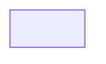

# Domain Model

> Ubiquitous-language contract for this feature. Source of truth for every term used in `SPEC.md`.
> `SPEC.md`'s `# Domain` section is a one-line pointer to this file; do not duplicate the glossary there.
> Replace this blockquote with a one-paragraph summary of the modeled subject before exiting the domain phase.

# Glossary

> Every term that appears in `SPEC.md` `# Intent` or `# Scenarios` must resolve to a row here unless it is generic
> per the project's ecosystem. Annotate cross-context terms inline as `[term](context: <ctx-id>)` so the bounded-context
> renderer can wire edges. Keep ≤8 rows; merge near-synonyms or split into a sibling DOMAIN.md when the table grows past that.

| Term | Definition | Context | Invariants |
|---|---|---|---|
| <Term> | <One-sentence definition in domain language> | <ctx-id or "—" for context-free> | <Rule that must always hold, or "—"> |

# Bounded Contexts

> Mermaid block auto-rendered by `tools.domain.render_mermaid` from `[term](context: <ctx-id>)` annotations in `# Glossary`.
> Each `ctx-id` becomes a node; an edge appears when a term carries an annotation that references a different context.
> Do not edit the rendered block by hand — the renderer is idempotent and will overwrite manual changes on the next pass.

# Aggregates

> Entities + their value objects + the invariants that hold inside the aggregate boundary.
> One aggregate per H2 subsection. List value-objects as bullets; list aggregate-local invariants beneath them.
> Cross-aggregate invariants belong in the `# Invariants` section below, not here.

## <Aggregate name>

- **Root entity:** <Term from glossary>
- **Value objects:** <Term, Term, …>
- **Local invariants:**
  - <Rule that holds inside this aggregate boundary>

# Invariants

> Cross-aggregate rules. Each invariant is one bullet, written as a falsifiable assertion.
> If an invariant is local to a single aggregate, move it under that aggregate above.

- <Cross-aggregate rule that the system must never violate>

# Open Questions

> Terms or relationships the domain phase could not resolve. Each becomes a deferred item the next phase
> (or a future feature) must close before the term ships into production code.

- <Term or relationship that needs follow-up; one bullet per question>
